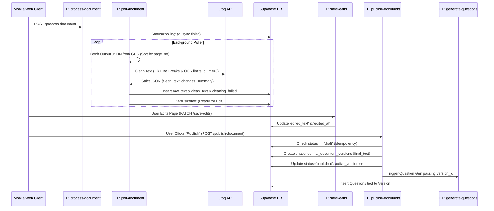

# Supabase + Google Document AI + Groq OCR Cleaning + Publish Flow

## 📌 1. Update Summary (Nələr Əlavə Edildi)
Bu versiyada tələblərinizə əsasən sistemə 2 böyük və kritik xüsusiyyət əlavə edildi:
1. **Groq OCR Cleaning (Mütləq):** Document AI-dan gələn OCR mətni (`raw_text`) birbaşa bazaya final kimi yazılmır. Yalnız OCR səhvlərini düzəltmək, defis (hyphenation) və sətir qırılmalarını təmizləmək məqsədilə `_shared/groq.ts` modulu LLM-ə (Groq - llama-3.3) müraciət edir. Groq fakt uydurmur, yalnız düzəliş edir və resultı strict JSON kimi: `{ "clean_text": "...", "changes_summary": "..." }` qaytarır.
2. **Teacher Edit Flow:** OCR/Groq emalı bitdikdən sonra sənəd `draft` (qaralama) statusu alır. Müəllim xüsusi "Review/Edit Screen" açıb səhifələri redaktə edə bilir. Serverdəki `save-edits` funksiyası `edited_text` sütununu debounced olaraq güncəlləyir.
3. **Publish & Versioning Flow:** Düzəliş (Edit) yekunlaşdıqdan sonra "Publish" edilir (`publish-document` funksiyası). Snapshot götürülərək (`final_text = COALESCE(edited_text, clean_text, raw_text)`) tamamilə immutable (dəyişdirilməz) olaraq `ai_document_versions` cədvəlində `snapshot_json` kimi yadda saxlanılır. Əvvəlki versiyaya qayıtmaq üçün version arxitekturası aktiv olur.
4. **Question Generation Logic:** Sual hazırlama modulu və promptları qəti olaraq dəyişilməlidir ki, sualı əsas sənədin özündən (və ya `raw_text`-dən) **YOX**, yalnız publish edilmiş version snapshot JSON-nun `final_text`-indən generasiya etsin.
5. **Verilənlər Bazası Dəyişiklikləri:** Draft, Publish statusları əlavə edildi. Limitlərə nəzarət etmək üçün Groq funksiyasına (p-limit: 3) maksimum paralellik tətbiq edildi. GCS limitlərinə qarşı cleanup işə salındı.

---

## 🔄 2. Yenilənmiş Axın Diaqramı (Mermaid Sequence)



---

## 📂 3. Yenilənmiş Fayl Ağacı (File Tree)

```text
supabase/
├── functions/
│   ├── _shared/
│   │   ├── google_auth.ts      
│   │   ├── gcs.ts              
│   │   ├── document_ai.ts      
│   │   ├── pdf_text.ts         
│   │   ├── jobs.ts             
│   │   └── groq.ts             # YENİ: Groq OCR Cleaning modulu
│   ├── process-document/       # İşin başladılması və GCS stream upload
│   │   └── index.ts
│   ├── poll-document/          # YENİLƏNDİ: JSON oxu, Groq Clean et, bazaya 'draft' yaz
│   │   └── index.ts
│   ├── save-edits/             # YENİ: Müəllimin düzəlişlərinin yadda saxlanması (autosave)
│   │   └── index.ts
│   └── publish-document/       # YENİ: Snapshot (Version) yarat və Q-Gen trigger et
│       └── index.ts
```

---

## 💻 4. Tam Kod Blokları (Copy-Paste Ready)

### A. `_shared/groq.ts` (Groq OCR Cleaning)
Səhv sətir qırılmalarını, hyphenation-ları düzəldən modul. Konkret format tələb olunur və 1-2 saniyədə cavablandırılır.

```typescript
// supabase/functions/_shared/groq.ts
export interface GroqCleanResult {
    clean_text: string;
    changes_summary: string | null;
}

export async function groqCleanText(rawText: string, langHint: 'az'|'en'|'mixed' = 'az'): Promise<GroqCleanResult> {
    const groqKey = Deno.env.get("GROQ_API_KEY");
    if (!groqKey) throw new Error("Missing GROQ_API_KEY");

    if (rawText.trim().length <= 15) {
        return { clean_text: rawText, changes_summary: "Too short to clean" };
    }

    const prompt = `
    You are a meticulous OCR text clearer.
    Your task is to fix scanning errors, broken hyphenations, and erratic line breaks in the following OCR text.
    LANGUAGE HINT: ${langHint}.
    
    CRITICAL RULES:
    1. DO NOT add any new information, facts, or commentary. Do not hallucinate.
    2. ONLY fix typos, whitespace, and formatting.
    3. Return ONLY a strict JSON object with this exact structure (NO extra markdown):
       {
         "clean_text": "The fully corrected text",
         "changes_summary": "Short 1-sentence summary of what kind of typos you fixed"
       }
    
    RAW OCR INPUT:
    """
    ${rawText}
    """
    `;

    const startTime = Date.now();
    const res = await fetch("https://api.groq.com/openai/v1/chat/completions", {
        method: "POST",
        headers: {
            "Authorization": `Bearer ${groqKey}`,
            "Content-Type": "application/json"
        },
        body: JSON.stringify({
            model: "llama-3.3-70b-versatile",
            response_format: { type: "json_object" },
            messages: [
                { role: "system", content: "You output strictly valid JSON." },
                { role: "user", content: prompt }
            ],
            temperature: 0.1 
        })
    });

    if (!res.ok) throw new Error(`Groq error: ${await res.text()}`);

    const data = await res.json();
    const content = data.choices[0]?.message?.content || "{}";
    
    const duration_ms = Date.now() - startTime;
    console.log(`Groq processed ${rawText.length} chars in ${duration_ms}ms`);

    try {
        const parsed = JSON.parse(content);
        return {
            clean_text: parsed.clean_text || rawText,
            changes_summary: parsed.changes_summary || null
        };
    } catch (e) {
        console.error("Groq JSON parsing failed", e);
        throw new Error("Invalid format returned by Groq");
    }
}
```

### B. `poll-document/index.ts` (Groq İnteqrasiyalı Poller)
Bitmiş Output JSON-u oxuyub parçalayır + Groq təmizliyi (max 3 paralel) tətbiq edərək bazaya `draft` olaraq verir.

```typescript
// supabase/functions/poll-document/index.ts
import { serve } from "https://deno.land/std@0.168.0/http/server.ts";
import { getOperationStatus } from "../_shared/document_ai.ts";
import { readGcsObjectJson, listGcsObjects, deleteGcsObject } from "../_shared/gcs.ts";
import { groqCleanText } from "../_shared/groq.ts";
import { createServiceClient } from "../_shared/supabase-client.ts";
import { handleCors, jsonResponse, errorResponse } from "../_shared/cors.ts";
import pLimit from "https://esm.sh/p-limit@4.0.0";

const limit = pLimit(3); // Miximum 3 concurrent Groq cleanups

serve(async (req: Request) => {
    const corsResp = handleCors(req);
    if (corsResp) return corsResp;

    try {
        const supabase = createServiceClient();
        const { job_id } = await req.json();

        const { data: job } = await supabase.from("ai_jobs").select("*").eq("id", job_id).single();
        if (!job || job.status !== 'polling') return jsonResponse({ status: job?.status || 'not_found' });

        const operation = await getOperationStatus(job.operation_name);

        if (!operation.done) {
            await supabase.from("ai_jobs").update({ last_heartbeat_at: new Date().toISOString() }).eq("id", job.id);
            return jsonResponse({ status: "polling" });
        }

        if (operation.error) {
            await supabase.from("ai_jobs").update({ status: 'failed', error_message: JSON.stringify(operation.error) }).eq('id', job.id);
            await supabase.from("ai_documents").update({ status: "failed" }).eq("id", job.document_id);
            return jsonResponse({ status: "failed", error: operation.error });
        }

        // Processing completed, read parsed JSON from GCS
        const bucket = Deno.env.get("GCS_BUCKET_TEMP")!;
        const { gcsInputPath, gcsOutputPrefix } = job.params;

        const objectNames = await listGcsObjects(bucket, gcsOutputPrefix);
        const jsonNames = objectNames.filter(n => n.endsWith('.json'));

        const rawPages = [];

        for (const objName of jsonNames) {
            const jsonOutput = await readGcsObjectJson(bucket, objName);
            if (!jsonOutput.document?.pages) continue;
            const textStr = jsonOutput.document.text || "";

            for (const p of jsonOutput.document.pages) {
                let pageText = "";
                let pNumber = parseInt(p.pageNumber || '1', 10);
                
                if (p.layout?.textSegment) {
                    const start = parseInt(p.layout.textSegment.startIndex || "0", 10);
                    const end = parseInt(p.layout.textSegment.endIndex || "0", 10);
                    pageText = textStr.substring(start || 0, end || 0);
                }
                rawPages.push({ page_no: pNumber, raw_text: pageText.trim() });
            }
        }

        rawPages.sort((a, b) => a.page_no - b.page_no); // SORT JSON order

        // Groq Cleaning
        const dbPages = await Promise.all(rawPages.map((p) => limit(async () => {
            let clean_text = p.raw_text;
            let changes_summary = null;
            let cleaning_failed = false;

            if (p.raw_text.length > 0) {
                try {
                    const groqRes = await groqCleanText(p.raw_text, 'az');
                    clean_text = groqRes.clean_text;
                    changes_summary = groqRes.changes_summary;
                } catch (err) {
                    console.error(`Groq error on page ${p.page_no}:`, err);
                    cleaning_failed = true; // DB marked as fail, fallback active
                }
            }

            return {
                document_id: job.document_id,
                page_no: p.page_no,
                raw_text: p.raw_text,
                clean_text: clean_text,
                cleaning_model: 'llama-3.3-70b-versatile',
                cleaning_version: 'v1',
                cleaning_failed: cleaning_failed,
                changes_summary: changes_summary,
                source: 'ocr'
            };
        })));

        for (let i = 0; i < dbPages.length; i += 10) {
            await supabase.from("ai_document_pages").insert(dbPages.slice(i, i + 10));
        }

        // Cleanup temp GCS
        let cleanupFailed = false;
        try {
            await deleteGcsObject(bucket, gcsInputPath);
            for (const n of jsonNames) await deleteGcsObject(bucket, n);
        } catch { cleanupFailed = true; }

        await supabase.from("ai_documents").update({ 
            status: "draft", 
            page_count: rawPages.length 
        }).eq("id", job.document_id);
        
        await supabase.from("ai_jobs").update({ status: 'completed', cleanup_failed: cleanupFailed }).eq('id', job.id);

        return jsonResponse({ status: "completed", draft_ready: true });
    } catch (e: any) {
        return errorResponse(e.message, 500);
    }
});
```

### C. `save-edits/index.ts` (Müəllim Tənzimləməsi - Autosave)
```typescript
// supabase/functions/save-edits/index.ts
import { serve } from "https://deno.land/std@0.168.0/http/server.ts";
import { createServiceClient, getUserId } from "../_shared/supabase-client.ts";
import { handleCors, jsonResponse, errorResponse } from "../_shared/cors.ts";

serve(async (req: Request) => {
    const corsResp = handleCors(req);
    if (corsResp) return corsResp;

    try {
        const userId = await getUserId(req);
        if (!userId) return errorResponse("Unauthorized", 401);

        const { document_id, page_no, edited_text } = await req.json();
        const supabase = createServiceClient();

        const { data: doc } = await supabase.from('ai_documents')
            .select('user_id, status')
            .eq('id', document_id)
            .single();

        if (!doc) return errorResponse("Not found", 404);
        if (doc.user_id !== userId) return errorResponse("Forbidden", 403);
        if (doc.status !== 'draft') return errorResponse("Document must be in 'draft' status to edit", 400);

        const now = new Date().toISOString();

        const { error } = await supabase.from('ai_document_pages')
            .update({
                edited_text: edited_text,
                edited_by: userId,
                edited_at: now
            })
            .match({ document_id: document_id, page_no: page_no });

        if (error) throw error;

        return jsonResponse({ success: true, saved_at: now });
    } catch (e: any) {
        return errorResponse(e.message, 500);
    }
});
```

### D. `publish-document/index.ts` (Sənədi Aktivləşdir və Version Snapshot Yarat)
Snapshot yaranarkən `final_text = COALESCE(edited_text, clean_text, raw_text)` prioriteti işlədilir.

```typescript
// supabase/functions/publish-document/index.ts
import { serve } from "https://deno.land/std@0.168.0/http/server.ts";
import { createServiceClient, getUserId } from "../_shared/supabase-client.ts";
import { handleCors, jsonResponse, errorResponse } from "../_shared/cors.ts";

serve(async (req: Request) => {
    const corsResp = handleCors(req);
    if (corsResp) return corsResp;

    try {
        const userId = await getUserId(req);
        if (!userId) return errorResponse("Unauthorized", 401);

        const { document_id, title, notes, trigger_qgen = true } = await req.json();
        const supabase = createServiceClient();

        const { data: doc } = await supabase.from('ai_documents').select('*').eq('id', document_id).single();
        if (!doc) return errorResponse("Not found", 404);
        if (doc.user_id !== userId) return errorResponse("Forbidden", 403);
        if (doc.status === 'published') return errorResponse("Already published", 409); // Idempotency check
        if (doc.status !== 'draft') return errorResponse("Document must be in 'draft' to publish", 400);

        // Fetch pages to establish final_text rules
        const { data: pages } = await supabase.from('ai_document_pages')
            .select('page_no, edited_text, clean_text, raw_text')
            .eq('document_id', document_id)
            .order('page_no', { ascending: true });

        const snapshotData = pages?.map(p => ({
            page_no: p.page_no,
            // PRIORITIZATION RULE
            final_text: p.edited_text ?? p.clean_text ?? p.raw_text ?? ''
        })) || [];

        const nextVersion = (doc.active_version || 0) + 1;
        const now = new Date().toISOString();

        // 1. Insert Version Snapshot (Immutable)
        const { data: versionDoc, error: vErr } = await supabase.from('ai_document_versions').insert({
            document_id: document_id,
            version: nextVersion,
            created_by: userId,
            created_at: now,
            snapshot_json: snapshotData,
            publish_notes: notes || null
        }).select().single();

        if (vErr) throw vErr;

        // 2. Update Document Status
        await supabase.from('ai_documents').update({
            status: 'published',
            published_at: now,
            active_version: nextVersion,
            file_name: title || doc.file_name
        }).eq('id', document_id);

        // 3. Trigger Question Generation (Async via Webhook/Job)
        if (trigger_qgen) {
           await supabase.from("ai_jobs").insert({
               document_id: document_id,
               user_id: userId,
               status: 'queued',
               job_type: 'generate_questions',
               params: { version_id: versionDoc.id } // Only feed the finalized text
           });
        }

        return jsonResponse({ success: true, status: 'published', version: nextVersion, version_id: versionDoc.id });
    } catch (e: any) {
        return errorResponse(e.message, 500);
    }
});
```

### E. Question Generation Input Selection Logic (Vacib Xülasə)
`generate-questions` yaradılan zaman server köhnə `raw_text` / `text` bazasına GİRMİR.
Ona yalnız spesifik version parametri verilir (`version_id`). Sual yaradan modul `ai_document_versions` daxilindəki `snapshot_json`-u oxuyaraq bütün sualları *yalnız* bu sarsılmaz redaktə bloku (`final_text`) əsasında edir. AI modelinə OCR cızıqları və gərəksiz xəta blokları yönləndirilmir.

---

## 🗄️ 5. Database Schema / Migrations (SQL)
Supabase SQL Editor-da işə salınmalıdır:

```sql
-- 1. Status Check Update
ALTER TABLE ai_documents DROP CONSTRAINT IF EXISTS ai_documents_status_check;
ALTER TABLE ai_documents
ADD COLUMN IF NOT EXISTS status TEXT DEFAULT 'processing' 
  CHECK (status IN ('processing', 'polling', 'draft', 'published', 'failed')),
ADD COLUMN IF NOT EXISTS published_at TIMESTAMPTZ,
ADD COLUMN IF NOT EXISTS active_version INT DEFAULT 1;

-- 2. ai_document_pages Extensions:
ALTER TABLE ai_document_pages
ADD COLUMN IF NOT EXISTS raw_text TEXT,
ADD COLUMN IF NOT EXISTS clean_text TEXT,
ADD COLUMN IF NOT EXISTS cleaning_model TEXT,
ADD COLUMN IF NOT EXISTS cleaning_version TEXT DEFAULT 'v1',
ADD COLUMN IF NOT EXISTS cleaning_failed BOOLEAN DEFAULT FALSE,
ADD COLUMN IF NOT EXISTS changes_summary TEXT,
ADD COLUMN IF NOT EXISTS edited_text TEXT,
ADD COLUMN IF NOT EXISTS edited_by UUID REFERENCES auth.users(id),
ADD COLUMN IF NOT EXISTS edited_at TIMESTAMPTZ;

-- 3. Versioning Table
CREATE TABLE IF NOT EXISTS ai_document_versions (
    id UUID PRIMARY KEY DEFAULT uuid_generate_v4(),
    document_id UUID REFERENCES ai_documents(id) ON DELETE CASCADE,
    version INT NOT NULL,
    created_at TIMESTAMPTZ DEFAULT NOW(),
    created_by UUID REFERENCES auth.users(id),
    snapshot_json JSONB NOT NULL,
    publish_notes TEXT
);

CREATE INDEX IF NOT EXISTS idx_ai_doc_versions_doc_id ON ai_document_versions (document_id);

-- 4. RLS for Versions
ALTER TABLE ai_document_versions ENABLE ROW LEVEL SECURITY;
CREATE POLICY "Users can insert their own versions" ON ai_document_versions FOR INSERT WITH CHECK (auth.uid() = created_by);
CREATE POLICY "Users can view their own versions" ON ai_document_versions FOR SELECT USING (auth.uid() = created_by);
```

---

## ✅ 6. Test Plan (8 Scenarios)

1. **Groq Success Limit:** p-limit testi. `DOCUMENT_OCR`dən 30 səhifə çıxar. Groq API-nə saniyədə yalnız maksimum 3 paralellik atıraraq həm Cloudflare error, həm ratelimit partlamasının qarşısını aldığını yoxlat.
2. **Groq Fail (Resilience):** `GROQ_API_KEY`-i dəyişib səhv et. Sistemin partlamadığını, array loopunun `cleaning_failed = true` verərək fallback olaraq təmiz mətn yerinə `raw_text` qaytardığını (UI-ın çökmədiyini) yoxla.
3. **Autosave Debounce (Edit):** UI "ReviewScreen"-də hərbi ləngimə (Type > Wait 2 seconds > Auto Save POST). Təkrar-təkrar `save-edits` endpointi çökdürülmədən `edited_text` güncəllənir.
4. **Publish Idempotency (Conflict):** Müəllim 2 pəncərədən sənədi açıq qoyub, 1ci pəncərədə Publish edəndə status 'published' olur. 2ci pəncərədən Publish basıldıqda 409 Conflict "Already published" qaytarılır. Heç bir halda 2 version birdən snapshot çıxarmır.
5. **Permissions/RLS Check:** A müəllim tərəfindən idarə olunan document_id, B müəlliminə API requestlə POST `save-edits` edəndə qəbul edilmir (403 Forbidden).
6. **Native PDF Bypass & Statuses:** Təmiz rəqəmsal sənəd (Standard PDF) oxunub tərkibindəki text birbaşa extract ediləndə lazımsız yerdə Document AI və Groq çalışdırmadan, anında statusun `draft` olduğuna nəzarət edir.
7. **Ordering Correctness & Cleanup Fail:** GCS output JSON faylları fərqli shard qırıqlarında `page.25`, `page.01` şəklində qayıdarsa `.sort((a,b) => a.page_no - b.page_no)` funksiyası ilə bazaya sıralı daxil edildiyi test olunur. Sonda Bucket temp cleaning API-si icazəsizliklə xəta verəndə Job `completed` statusu alır, lakin logda `cleanup_failed=true` gözə çarpır.
8. **Question Generation Data Input:** "Questions" app ekranı sadəcə ən son publish edilmiş versiyanı çağırır və daxilində yalnız `final_text` cümlələri görünür.
